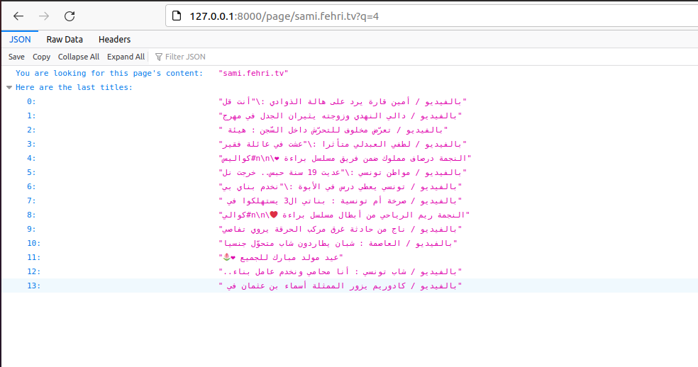
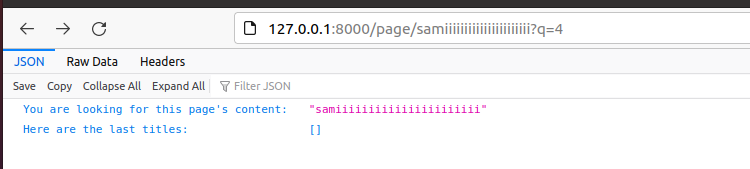
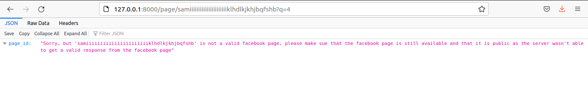

<div align="center">


  <h3 align="center">Assignment</h3>

  <p align="center">
    A basic test project
    <br />
    <a href="https://github.com/hajer-bouani/elyadataFbPageScrap/issues">Report Bug</a>
    ·
    <a href="https://github.com/hajer-bouani/elyadataFbPageScrap/issues">Request Feature</a>
  </p>
</div>

<!-- TABLE OF CONTENTS -->
<details>
  <summary>Table of Contents</summary>
  <ol>
    <li>
      <a href="#about-the-project">About The Project</a>
      <ul>
        <li><a href="#built-with">Built With</a></li>
      </ul>
    </li>
    <li>
      <a href="#getting-started">Getting Started</a>
      <ul>
        <li><a href="#prerequisites">Prerequisites</a></li>
      </ul>
    </li>
    <li><a href="#usage">Usage</a></li>
  </ol>
</details>

<!-- ABOUT THE PROJECT -->
## About The Project

Create scrapping service:
* Build Facebook (1 public page) scrapping service using fastAPI.
* Save scrapping data in database
* Run the services in a docker container

<p align="right">(<a href="#top">back to top</a>)</p>

### Built With

Major frameworks/libraries used to bootstrap this project are:

* [python](https://www.python.org/)
* [fastapi](https://fastapi.tiangolo.com/)

<p align="right">(<a href="#top">back to top</a>)</p>

<!-- GETTING STARTED -->
## Getting Started

Clone this repository to your local envirment

### Prerequisites

You should have docker and docker compose installed ont the linux machine as the app wwill run inside docker containers.
* docker
  ```sh
  $ sudo apt-get remove docker docker-engine docker.io containerd runc
  $ sudo apt-get update
  $ sudo apt-get install \
  $  ca-certificates \ 
  $  curl \
  $  gnupg \
  $  lsb-release
  $ curl -fsSL https://download.docker.com/linux/ubuntu/gpg | sudo gpg --dearmor -o /usr/share/keyrings/docker-archive-keyring.gpg
  $ echo "deb [arch=$(dpkg --print-architecture) signed-by=/usr/share/keyrings/docker-archive-keyring.gpg] https://download.docker.com/linux/ubuntu (lsb_release -cs) stable" | sudo tee /etc/apt/sources.list.d/docker.list > /dev/null
  ```
* docker-compose
  ```sh
  $ sudo curl -L "https://github.com/docker/compose/releases/download/1.29.2/docker-compose-$(uname -s)-$(uname -m)" -o /usr/local/bin/docker-compose
  $ sudo chmod +x /usr/local/bin/docker-compose
  ```


<!-- USAGE EXAMPLES -->
## Usage

Executing startApplication.sh file will run the servers

* docker-compose
  ```sh
  $   sudo chmod +x startApplication.sh
  $   ./startApplication.sh
  ```

In order to check the server running, go to <a href=http://127.0.0.1:8000>http://127.0.0.1:8000</a>
</br>Mongo-express is running on posrt 8081 on <a href=http://127.0.0.1:8081>http://127.0.0.1:8081</a>
</br>A execution example can be seen in the folowing screenshots

</br>If the facebook page has no posts</br>

</br>If the given page_id is not a valid facebook page</br>

<p align="right">(<a href="#top">back to top</a>)</p>


f/*-d1d
